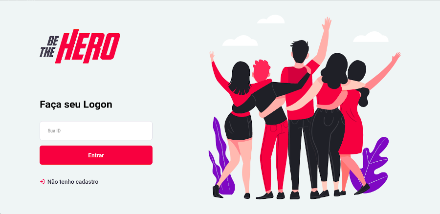
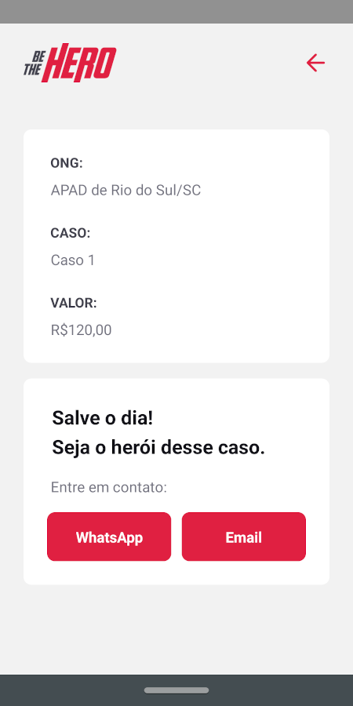

# Be The Hero

  

    

## Sobre o Projeto
O **Be The Hero** foi desenvolvido como parte de um curso da Rocketseat, durante uma semana intensiva de aprendizado e desenvolvimento. O projeto tem como objetivo conectar ONGs e instituições a pessoas dispostas a ajudar financeiramente em casos específicos.

A aplicação é composta por três partes principais:
- **Backend**: API desenvolvida em Node.js com Express e banco de dados SQLite.
- **Frontend**: Interface web criada com React para que ONGs possam cadastrar casos e gerenciar doações.
- **Mobile**: Aplicação móvel feita em React Native e Expo, permitindo que doadores acessem os casos e entrem em contato diretamente com as ONGs.

## Tecnologias Utilizadas
- **Frontend**: React 16.13.1, React Router, Axios
- **Backend**: Node.js 14.x, Express 4.17.1, Knex, SQLite 4.1.1, Celebrate (validação de dados)
- **Mobile**: React Native (Expo SDK 37.0.3), React Navigation 5.1.4, Axios, Expo Mail Composer

## Estrutura do Repositório
O repositório contém três diretórios principais:
- `/backend` → Código da API em Node.js.
- `/frontend` → Aplicação web em React.
- `/mobile` → Aplicação mobile em React Native.

## Imagens do Projeto

  
  

## Instalação e Configuração
Para rodar o projeto, siga as instruções de cada stack no respectivo README de cada diretório:
- [Backend](backend/README.md)
- [Frontend](frontend/README.md)
- [Mobile](mobile/README.md)

## Licença
Este projeto foi desenvolvido para fins educacionais e pode ser utilizado livremente para estudo e aprendizado.

---

Para dúvidas ou suporte, entre em contato com a comunidade da Rocketseat ou com os desenvolvedores.